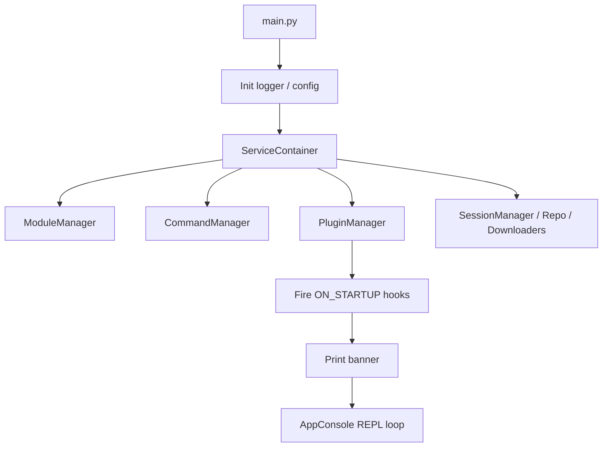
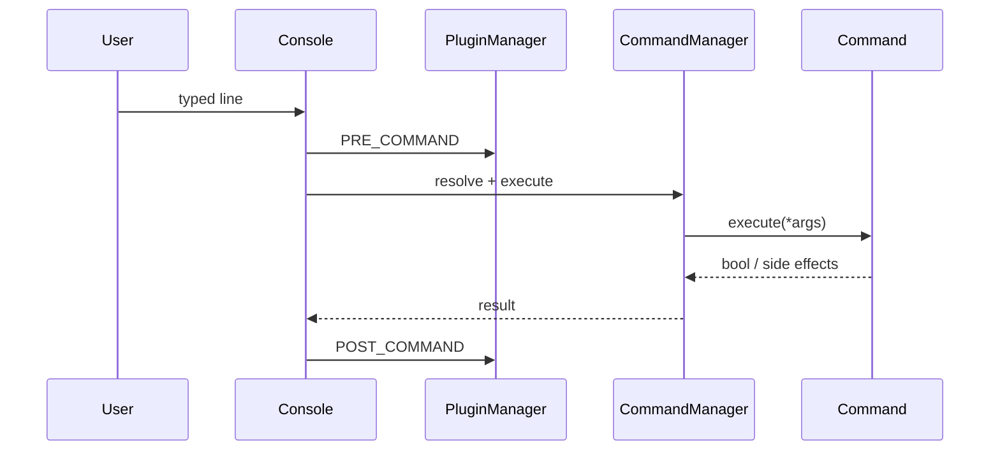
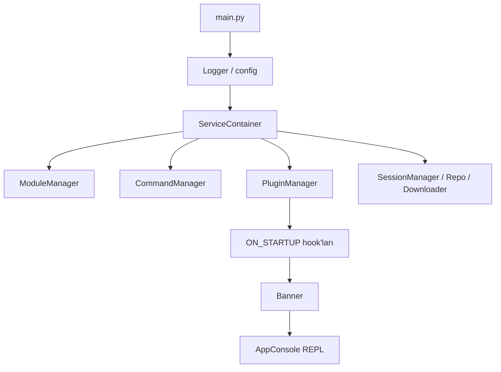
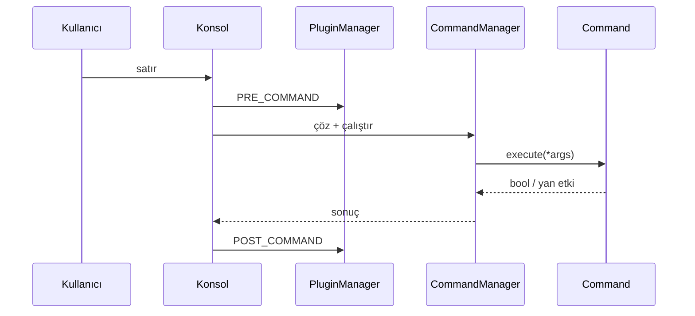

# Architecture / Mimari

[🇬🇧 English](#-english) | [🇹🇷 Türkçe](#-türkçe)

---

<a name="-english"></a>
## 🇬🇧 English

High-level overview of how Mah Framework is structured and how requests flow through the system.

### Directory Layout

```text
mah-framework/
├── main.py                 # Entry point, DI wiring, banner
├── core/                   # Framework engine
│   ├── console.py          # Interactive REPL loop
│   ├── command_manager.py  # Discover / resolve / run commands
│   ├── module_manager.py   # Discover / load / select modules
│   ├── plugin_manager.py   # Load plugins and dispatch hooks
│   ├── session_manager.py  # Active agent / shell sessions
│   ├── handler.py          # Unified listener helpers
│   ├── hooks.py            # HookType enum
│   ├── module.py           # BaseModule
│   ├── option.py           # Option definition / validation
│   ├── plugin.py           # BasePlugin
│   ├── command.py          # Base Command
│   ├── logger.py           # loguru setup (config/logs/)
│   ├── completer.py        # prompt_toolkit completions
│   ├── repo_manager.py     # Remote git repos
│   ├── module_downloader.py
│   ├── plugin_downloader.py
│   ├── service_container.py
│   ├── context.py          # AppContext
│   ├── shared_state.py     # Global service handles
│   ├── validation_pipeline.py
│   └── encoders/           # Payload encoders (base64, xor, ...)
├── commands/               # One file per CLI command
├── modules/                # Exploit / auxiliary / payload / post
├── plugins/                # Event-driven extensions
├── config/                 # aliases, repos, logs, wordlists
├── templates/              # Starter templates (plugin, ...)
├── build/                  # Chimera builder / obfuscator tools
├── tests/                  # pytest suite
└── docs/                   # This documentation
```

### Core Components

| Component | Role |
| --------- | ---- |
| **AppConsole** | Reads user input, routes to CommandManager, keeps prompt context |
| **CommandManager** | Loads `commands/*.py`, resolves aliases, executes commands |
| **ModuleManager** | Scans `modules/`, instantiates `BaseModule`, tracks selection |
| **PluginManager** | Loads `plugins/`, registers hooks, fires events |
| **SessionManager** | Tracks live sessions (ID, host, type, handler) |
| **RepoManager** | Clones/updates remote module repositories under `config/repos/` |
| **ModuleDownloader** | Searches/installs modules from cloned repos with verify support |
| **ServiceContainer** | Lightweight DI container used at startup |
| **shared_state** | Convenient global access for commands/modules to managers |

### Startup Flow



1. `main.py` builds the service graph.
2. Managers discover commands, modules, and plugins from disk.
3. `ON_STARTUP` hooks run.
4. Banner is printed (unless `-q`).
5. Optional `-r` / `-x` commands execute.
6. Interactive console waits for input.

### Command Execution Flow



When the command is `run` / `exploit` / `execute`:

1. `PRE_MODULE_RUN` hooks fire.
2. Selected module's `run(options)` executes.
3. `POST_MODULE_RUN` hooks fire with success flag.

### Module Model

Every module inherits `core.module.BaseModule`:

* Metadata: `Name`, `Description`, `Author`, `Category`, `Version`, `Requirements`
* `Options: dict[str, Option]` — validated user inputs
* `run(options)` — business logic
* Path is assigned by ModuleManager from filesystem location

Selecting a module (`use`) updates console prompt context and fires `ON_MODULE_SELECT`. Changing options with `set` fires `ON_OPTION_SET`.

### Plugin / Hook Model

Plugins inherit `BasePlugin` and return a `{HookType: handler}` map from `get_hooks()`.

Important hooks:

| Hook | When |
| ---- | ---- |
| `ON_STARTUP` / `ON_SHUTDOWN` | Framework lifecycle |
| `PRE_COMMAND` / `POST_COMMAND` | Around every CLI command |
| `PRE_MODULE_RUN` / `POST_MODULE_RUN` | Around `run` |
| `ON_MODULE_SELECT` / `ON_OPTION_SET` | Module context changes |
| `ON_SESSION_OPEN` / `ON_SESSION_CLOSE` | Session lifecycle |
| `PRE_MODULE_LOAD` / `POST_MODULE_LOAD` | Module discovery |
| `PRE_PLUGIN_LOAD` / `POST_PLUGIN_LOAD` | Plugin discovery |
| `ON_ERROR` | Exception reporting |

Priority: lower `Priority` value runs earlier.

### Session Model

Payloads / handlers register connections with `SessionManager`. Users manage them via `sessions`. Chimera sessions expose an interactive sub-shell (`chimera (N) >`) with agent commands documented in [CHIMERA_USER_GUIDE.md](CHIMERA_USER_GUIDE.md).

### Configuration & Runtime Artifacts

| Path | Purpose |
| ---- | ------- |
| `config/aliases.json` | User-defined aliases |
| `config/repos.json` | Registered remote repos |
| `config/repos/` | Cloned repository checkouts |
| `config/installed_modules.json` | Downloaded module registry |
| `config/installed_plugins.json` | Downloaded plugin registry |
| `config/logs/` | Rotating application logs |
| `config/wordlists/` | Shared wordlists for scanners |
| `.mah_history` | prompt_toolkit history |

### Extension Points

| Want to add... | Put it in... | Inherit |
| -------------- | ------------ | ------- |
| CLI command | `commands/foo.py` | `Command` |
| Tool / exploit / scanner | `modules/.../foo.py` | `BaseModule` |
| Background behavior | `plugins/foo.py` | `BasePlugin` |
| Encoder | `core/encoders/` | existing encoder pattern |

See [DEVELOPER_GUIDE.md](DEVELOPER_GUIDE.md) and [PLUGIN_GUIDE.md](PLUGIN_GUIDE.md).

---

<a name="-türkçe"></a>
## 🇹🇷 Türkçe

Mah Framework'ün yapısı ve isteklerin sistem içinde nasıl aktığına dair üst seviye bakış.

### Dizin Yapısı

```text
mah-framework/
├── main.py                 # Giriş noktası, DI, banner
├── core/                   # Framework motoru
│   ├── console.py          # Etkileşimli REPL döngüsü
│   ├── command_manager.py  # Komut keşif / çözüm / çalıştırma
│   ├── module_manager.py   # Modül keşif / yükleme / seçim
│   ├── plugin_manager.py   # Plugin yükleme ve hook dağıtımı
│   ├── session_manager.py  # Aktif ajan / shell oturumları
│   ├── handler.py          # Birleşik dinleyici yardımcıları
│   ├── hooks.py            # HookType enum
│   ├── module.py           # BaseModule
│   ├── option.py           # Option tanımı / doğrulama
│   ├── plugin.py           # BasePlugin
│   ├── command.py          # Temel Command
│   ├── logger.py           # loguru kurulumu (config/logs/)
│   ├── completer.py        # prompt_toolkit tamamlama
│   ├── repo_manager.py     # Uzak git depoları
│   ├── module_downloader.py
│   ├── plugin_downloader.py
│   ├── service_container.py
│   ├── context.py          # AppContext
│   ├── shared_state.py     # Global servis tutamaçları
│   ├── validation_pipeline.py
│   └── encoders/           # Payload encoder'ları
├── commands/               # Her CLI komutu için bir dosya
├── modules/                # Exploit / auxiliary / payload / post
├── plugins/                # Olay tabanlı uzantılar
├── config/                 # alias, repo, log, wordlist
├── templates/              # Başlangıç şablonları
├── build/                  # Chimera builder / obfuscator
├── tests/                  # pytest paketi
└── docs/                   # Bu dokümantasyon
```

### Çekirdek Bileşenler

| Bileşen | Görev |
| ------- | ----- |
| **AppConsole** | Girdi okur, CommandManager'a yönlendirir, prompt bağlamını tutar |
| **CommandManager** | `commands/*.py` yükler, alias çözümler, komut çalıştırır |
| **ModuleManager** | `modules/` tarar, `BaseModule` örnekler, seçimi izler |
| **PluginManager** | `plugins/` yükler, hook kaydeder, olay tetikler |
| **SessionManager** | Canlı oturumları (ID, host, tip, handler) izler |
| **RepoManager** | Uzak depoları `config/repos/` altına klonlar/günceller |
| **ModuleDownloader** | Klonlanmış depolardan modül arar/kurar, doğrular |
| **ServiceContainer** | Açılışta kullanılan hafif DI konteyneri |
| **shared_state** | Komut/modüllerin yöneticilere erişimi için global tutamak |

### Başlatma Akışı



1. `main.py` servis grafığını kurar.
2. Yöneticiler diskten komut, modül ve plugin keşfeder.
3. `ON_STARTUP` hook'ları çalışır.
4. Banner basılır (`-q` değilse).
5. İsteğe bağlı `-r` / `-x` komutları çalışır.
6. Etkileşimli konsol girdi bekler.

### Komut Çalıştırma Akışı



Komut `run` / `exploit` / `execute` ise:

1. `PRE_MODULE_RUN` tetiklenir.
2. Seçili modülün `run(options)` metodu çalışır.
3. `POST_MODULE_RUN` başarı bayrağıyla tetiklenir.

### Modül Modeli

Her modül `core.module.BaseModule` miras alır:

* Meta: `Name`, `Description`, `Author`, `Category`, `Version`, `Requirements`
* `Options: dict[str, Option]` — doğrulanmış kullanıcı girdileri
* `run(options)` — iş mantığı
* Path, dosya konumundan ModuleManager tarafından atanır

`use` ile seçim prompt bağlamını günceller ve `ON_MODULE_SELECT` tetikler. `set` ile seçenek değişimi `ON_OPTION_SET` tetikler.

### Plugin / Hook Modeli

Pluginler `BasePlugin` miras alır ve `get_hooks()` ile `{HookType: handler}` döner.

Önemli hook'lar yukarıdaki İngilizce tabloda listelenmiştir. `Priority` değeri düşük olan daha önce çalışır.

### Oturum Modeli

Payload / handler bağlantıları `SessionManager`'a kaydolur. Kullanıcı `sessions` ile yönetir. Chimera oturumları `chimera (N) >` alt kabuğu açar — detay: [CHIMERA_USER_GUIDE.md](CHIMERA_USER_GUIDE.md).

### Yapılandırma ve Çalışma Zamanı Artıkları

| Yol | Amaç |
| --- | ---- |
| `config/aliases.json` | Kullanıcı alias'ları |
| `config/repos.json` | Kayıtlı uzak depolar |
| `config/repos/` | Klonlanmış depolar |
| `config/installed_modules.json` | İndirilen modül kaydı |
| `config/installed_plugins.json` | İndirilen plugin kaydı |
| `config/logs/` | Dönen uygulama logları |
| `config/wordlists/` | Tarayıcı wordlist'leri |
| `.mah_history` | prompt_toolkit geçmişi |

### Genişletme Noktaları

| Eklemek istediğiniz | Konum | Miras |
| ------------------- | ----- | ----- |
| CLI komutu | `commands/foo.py` | `Command` |
| Araç / exploit / scanner | `modules/.../foo.py` | `BaseModule` |
| Arka plan davranışı | `plugins/foo.py` | `BasePlugin` |
| Encoder | `core/encoders/` | mevcut encoder kalıbı |

Bkz. [DEVELOPER_GUIDE.md](DEVELOPER_GUIDE.md) ve [PLUGIN_GUIDE.md](PLUGIN_GUIDE.md).
